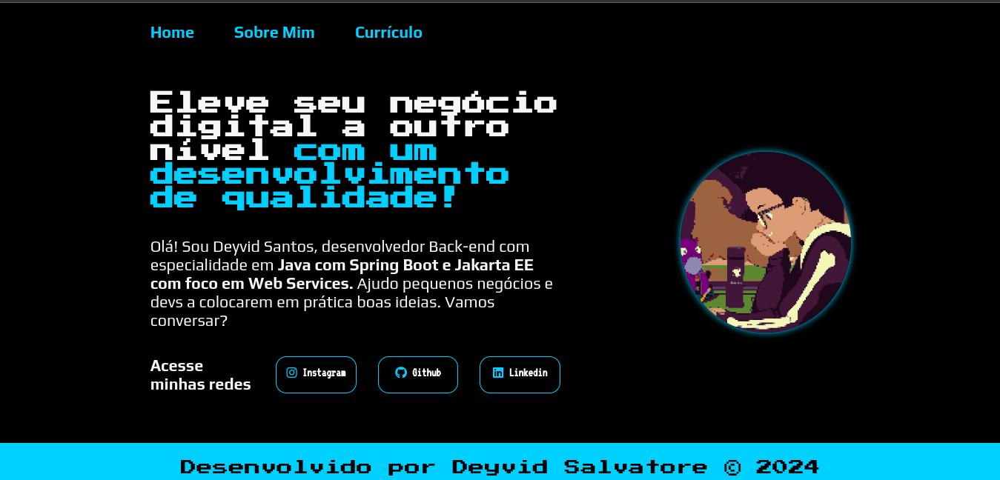
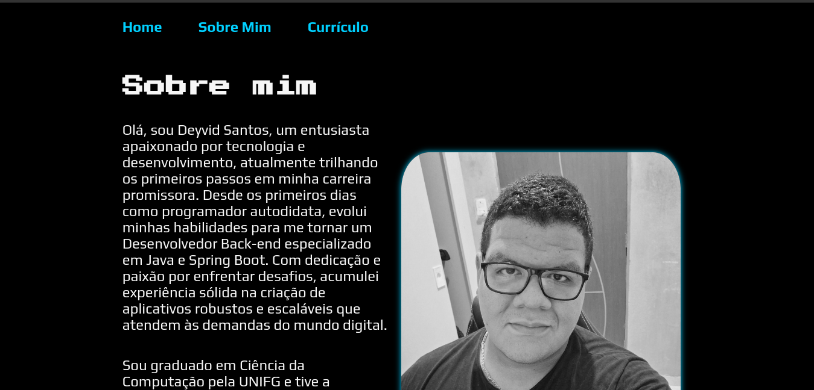
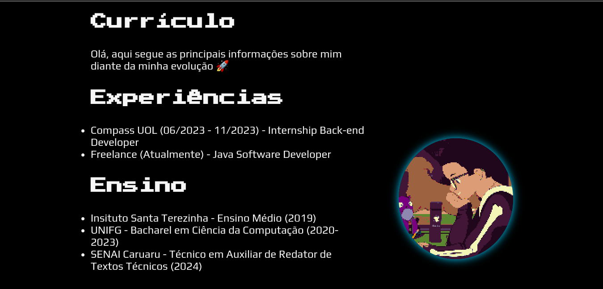

# 👨‍💻 Portfolio - Projeto didático
O objetivo principal é demonstrar habilidades em desenvolvimento web, destacando informações relevantes sobre o autor, suas experiências, habilidades e conquistas.
## 📐 Estrutura do Projeto
O projeto consiste em três páginas principais:
### 1. Home (index.html)
* Apresenta uma mensagem de destaque sobre o autor, enfatizando suas habilidades em desenvolvimento de qualidade. 
* Fornece links de navegação para as seções "Sobre Mim" e "Currículo". 
* Inclui links para as redes sociais do autor.

### 2. Jornada (sobre.html)
* Detalha a jornada e as habilidades do autor.
* Destaca a formação acadêmica e projetos relevantes.
* Apresenta uma imagem ilustrativa do autor.

### 3. Currículo (curriculo.html)
* Apresenta informações detalhadas sobre as experiências profissionais e educacionais do autor.
* Inclui seções dedicadas a experiências, educação e estudos adicionais.
* Fornece links para certificados de cursos relevantes.

## ⚙️ Tecnologias Utilizadas
* Linguagens: HTML, CSS
* Framework: Font Awesome (para ícones)

## 🚀 Como Visualizar
### 1. Localmente
1. Baixe o Zip através do botão **Code** e **Download ZIP**
2. Extraia os arquivos e abra o **index.html**
### 2. Web
1. Basta apenas clicar no link na seção **About**
2. Apenas divirta-se.

**Observação:** Este projeto é puramente didático e representa uma estrutura básica de um portfólio. Se sinta livre se quiser customizar. 😎